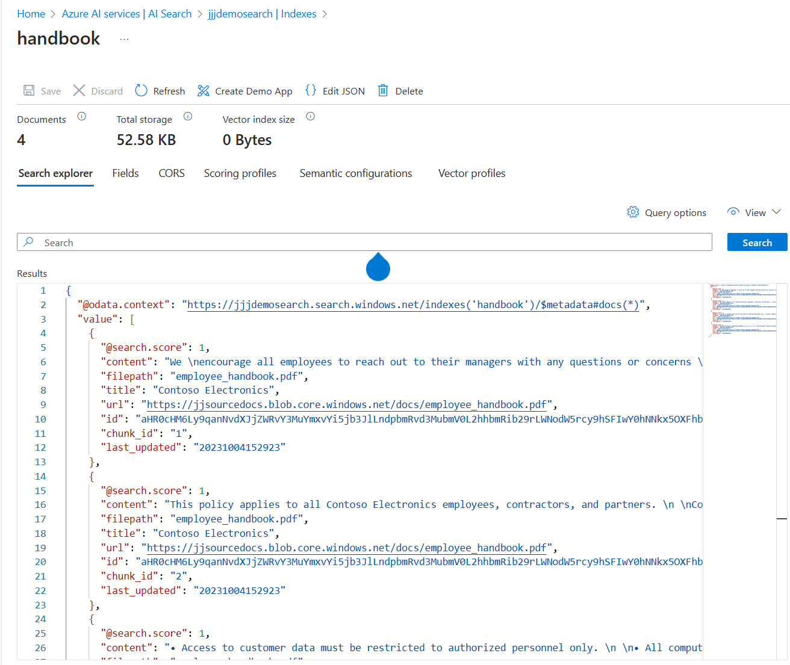

# Azure OpenAI from the ground up
## Introduction
This tutorial is intended to help your understanding of Azure OpenAI from the developer's perspective. How to programmatically interact with Azure OpenAI and how to run chat sessions against the the [Azure OpenAI REST API](https://learn.microsoft.com/en-us/azure/ai-services/openai/reference).

## Azure OpenAI

## Concepts

## Tutorial Prerequisites
The rest of this tutorial is based around executing HTTP REST requests against Azure OpenAI. All of the other SDKs and frameworks that get used in other programming languages such as Python or C# .NET will use these REST APIs. In addition, higher-level frameworks such as [langchain](https://www.langchain.com/) or [Semantic Kernel](https://github.com/microsoft/semantic-kernel) are built ontop of these APIs.

In the [Azure Portal](https://portal.azure.com/) provision the resources below:
1. Create a resource group openai-groundup-rg
2. In this resource group create and instance of Azure OpenAI
3. Take a note of its endpoint and key
4. In this OpenAI resource, open up AI Studio and deploy the following models:
5.   gpt-35-turbo
6.   text-embedding-ada-002
7. For later, deploy a storage account, create a bl;ob container and upload the same PDF from this repo into the blob container
8. Create an Azure Search instance
9. Take a note of its endpoint and key

In addition to the above Azure resources, the tutorial will use Visual Studio code and a marketplace extension  [REST Client](https://marketplace.visualstudio.com/items?itemName=humao.rest-client) that will allow you to execute HTTP REST requests in Visual Studio Code. Alternatively, you can use other techniques, but this tutorial will concentrate on REST Client.

The above should allow you to run all of the steps in this tutorial.

## Tutorial Steps
### Task 1 - your first OpenAI call
Inside Visual Studio code, create a new file and save as "openai-samples.http". This will then indicate to VS Code that the REST client can then use this file to execute HTTP REST requests.

In the blank file type:
```
POST https://YOUR_RESOURCE_NAME.openai.azure.com/openai/deployments/YOUR_DEPLOYMENT_NAME/completions?api-version=2024-02-01
Content-Type: application/json
api-key: YOUR_RESOURCE_KEY

{
    "prompt": "Once upon a time",
    "max_tokens": 10
}
```
Replace the 3 placeholders with the values from your Azure OpenAI instance. Save and a "Send Request" link should appear. Click the link.

You should get a response like below:
```
HTTP/1.1 200 OK
Cache-Control: no-cache, must-revalidate
Content-Length: 307
Content-Type: application/json
access-control-allow-origin: *
apim-request-id: 97431f0d-859c-48db-bc01-9b5f6df8ea3d
Strict-Transport-Security: max-age=31536000; includeSubDomains; preload
x-content-type-options: nosniff
x-ms-region: West Europe
x-ratelimit-remaining-requests: 29
x-ratelimit-remaining-tokens: 29960
x-accel-buffering: no
x-ms-rai-invoked: true
x-request-id: 7b0041e6-b032-4bbe-8cd0-31efb80be5c2
x-ms-client-request-id: 97431f0d-859c-48db-bc01-9b5f6df8ea3d
azureml-model-session: turbo-0301-b90147a4
Date: Tue, 09 Apr 2024 15:42:01 GMT
Connection: close

{
  "id": "cmpl-9C7thWlxje46HDdYv69Ous51AZucM",
  "object": "text_completion",
  "created": 1712677321,
  "model": "gpt-35-turbo",
  "choices": [
    {
      "text": ", there was a Bookseller who lived in Manchester",
      "index": 0,
      "finish_reason": "length",
      "logprobs": null
    }
  ],
  "usage": {
    "prompt_tokens": 4,
    "completion_tokens": 10,
    "total_tokens": 14
  }
}
```
What can be seen from above is that it worked (there will be a different answer each time) and that it used 4 prompt tokens and 10 completion tokens.

Try varying the *max_tokens* to see how this impacts the response.

There are also a lot of potentially interesting HTTP headers which may be used to understand more about the service and its capacity.

### Task 2 - parameterising the REST call
The REST client has several ways in which calls to APIs can be parameterised. This is really useful for later calls. The simplest approach is to declare some variables, set their value and then use these variables in the REST call.

The REST client has the means of having multiple requests in one file. These can be separated by a comment line. Add below to the file after the first request
```
### a parameterised request to completions
@openaiendpoint=YOUR_RESOURCE_NAME
@openaichatmode=YOUR_DEPLOYMENT_NAME
@openaikey=YOUR_RESOURCE_KEY

POST https://{{openaiendpoint}}.openai.azure.com/openai/deployments/{{openaichatmodel}}/completions?api-version=2023-05-15
api-key: {{openaikey}}
Content-Type: application/json

{
    "prompt": "Once upon a time",
    "max_tokens": 10
}
```

The above should allow you to reuse the parameters on later requests. A better way for files that are going to be put into a GitHub repo is to use an environment variable with VS Code. This firstly keeps secrets out of the file, but it also allows named environments that may have different values. For example:
```
"rest-client.environmentVariables": {
    "$shared": {
        "version": "v1",
        "prodToken": "foo",
        "nonProdToken": "bar"
    },
    "local": {
        "version": "v2",
        "host": "localhost",
        "token": "{{$shared nonProdToken}}",
        "secretKey": "devSecret"
    },
    "production": {
        "host": "example.com",
        "token": "{{$shared prodToken}}",
        "secretKey" : "prodSecret"
    }
}
```
In the above, there are local and production for distinct values and $shared for common values across environments. In VS Code this gets stored in .vscode with the name *settings.json*. This is the preferred method for dealing with variables, especially secrets such as OpenAI keys.

### Task 3 - chat completions
In the first examples, we are providing a simple prompt which then gets completed.

Most OpenAI implementations want to do chat - that is one or more questions that form a chat. This allows the easy creation of starting with a general question and then later asking a another question about the response. This mimics the ways in which humans discover information from others - starting more general and then honing the next question based on the response.

The format of the HTTP requests for chat completions is slightly different. It has a slightly different URL and a different request format.

```
### first chat completion. Note the URL change and the request body change

POST https://{{openaiendpoint}}.openai.azure.com/openai/deployments/{{openaichatmodel}}/chat/completions?api-version=2023-05-15
api-key: {{openaikey}}
Content-Type: application/json

{
    "messages": [
        {
            "role": "user",
            "content": "Does Azure OpenAI support customer managed keys?"
        }
    
    ]
}
```
Executing this request should produce something like (removing the response headers to save space):
```
{
  "choices": [
    {
      "finish_reason": "stop",
      "index": 0,
      "message": {
        "content": "Yes, Azure OpenAI supports customer managed keys through Azure Key Vault. Customers can manage encryption keys for their OpenAI resources in Azure Key Vault and use them for data encryption at rest and in transit. By integrating Azure Key Vault with OpenAI, customers can ensure their data is secure and compliant with their organization’s security policies.",
        "role": "assistant"
      }
    }
  ],
  "created": 1712678922,
  "id": "chatcmpl-9C8JWAZBcrs5736QjPMGKZAKX4WLV",
  "model": "gpt-35-turbo",
  "object": "chat.completion",
  "system_fingerprint": null,
  "usage": {
    "completion_tokens": 65,
    "prompt_tokens": 17,
    "total_tokens": 82
  }
}
```
Note that the response format is also different.

### Task 4 system prompts
In most chat scenarios our customers may want to build, just presenting Azure OpenAI with the user's query or prompt may be a little too uncontrolled. It would be really useful if the chat could be directed to answer the question in specfic ways or to restrict how the chat will respond to a user's prompt.

This is a whole subject area called [prompt engineering](https://en.wikipedia.org/wiki/Prompt_engineering). All of this us used to create a *system prompt* that gets sent to the API alongdise the actual user's prompt.

There is much work out there to help craft system prompts for specific use cases. This is outside this tutorial, but there are many resources that can help craft system prompts.

At an API level, a system prompt is merely another section in the JSON body that is sent with the HTTP POST request. In general, system prompts are added by the application sending the requests to the OpenAI REST API and not by the user. In this way, the system prompt can protect both the organisation and the user from prompts that doi not succeed in correctly answering a user query. Try this sample below:

```
### chat completion - but restrict output to Azure only conversations!!
POST https://{{openaiendpoint}}.openai.azure.com/openai/deployments/{{openaichatmodel}}/chat/completions?api-version=2023-05-15
api-key: {{openaikey}}
Content-Type: application/json

{
    "messages": [
        {
            "role": "system",
            "content": "You are an Azure-only assistant. Only give answers from Azure documentation. If the customer asks about another cloud provider, politely decline and respond that you are an Azure assistant."
        },
        {
            "role": "user",
            "content": "In AWS what is the container service called?"
        }
    
    ]
}
```

This can produce the following response:
```
{
  "choices": [
    {
      "finish_reason": "stop",
      "index": 0,
      "message": {
        "content": "I'm sorry, but as an Azure assistant, I'm not able to answer questions about AWS. However, if you have any questions about Azure Container Service or any other Azure-related topic, feel free to ask!",
        "role": "assistant"
      }
    }
  ],
  "created": 1712679694,
  "id": "chatcmpl-9C8VyVffqWzzUdDeGEp1L6IHK9Mim",
  "model": "gpt-35-turbo",
  "object": "chat.completion",
  "system_fingerprint": null,
  "usage": {
    "completion_tokens": 43,
    "prompt_tokens": 56,
    "total_tokens": 99
  }
}
```

In general, it can take much testing and refinement to end up with an effective system prompt. Projects that use Azure OpenAI chat should set some time aside for prompt testing and refinement - this should be done with business or product owner stakeholders to make sure it matches their expectations.

Prompt engineering is one of the main ways in which a user of the chat application can be stopped from subverting the intention of the chat application. This is know as [jailbreaking](https://learnprompting.org/docs/prompt_hacking/jailbreaking). End customer facing (as opposed to internally-facing) applications could be targets of jailbreaking attempts. Whilst most of these can be harmless, some of these may cause reputational damage to the organisation. 

### Task 5 - understanding more on context
Enter this query:
```


### chat completion - model trained date
POST https://{{openaiendpoint}}.openai.azure.com/openai/deployments/{{openaichatmodel}}/chat/completions?api-version=2023-05-15
api-key: {{openaikey}}
Content-Type: application/json

{
    "messages": [
        {
            "role": "user",
            "content": "Who is the reigning monarch of the United Kingdom?"
        }
    
    ]
}
```
If you ran this on a gpt-35 model, the answer is likely to be:
```
{
  "choices": [
    {
      "finish_reason": "stop",
      "index": 0,
      "message": {
        "content": "The reigning monarch of the United Kingdom is Queen Elizabeth II.",
        "role": "assistant"
      }
    }
  ],
  "created": 1712680378,
  "id": "chatcmpl-9C8h0DTTiC7SrJ5604yzwuMDeWdiw",
  "model": "gpt-35-turbo",
  "object": "chat.completion",
  "system_fingerprint": null,
  "usage": {
    "completion_tokens": 12,
    "prompt_tokens": 28,
    "total_tokens": 40
  }
}
```
gpt4 may give a more accurate answer.

This is to illustrate that the completion is based on 2 things. Firstly when the underlying model's training was performed and secondly on the prompt given. This is important to understand.

### Task 6 - conversations
As previously discussed, the Azure OpenAI API is stateless. That is it can only do a completion based upon the combination of its knowledge from its training and the prompt sent to it.

To mimic a conversation, each step of that conversation will add to the context sent to the API. At an API level, this is really simple, the JSON message sent to the API must add each user and *assistant* prompt as the user progresses through the conversation.

```
### chat completion - multiple prompt - initial question:
POST https://{{openaiendpoint}}.openai.azure.com/openai/deployments/{{openaichatmodel}}/chat/completions?api-version=2023-05-15
api-key: {{openaikey}}
Content-Type: application/json

{
    "messages": [
        {
            "role": "system",
            "content": "You are an Azure-only assistant. Only give answers from Azure documentation. If the customer asks about another cloud provider, suggest the Azure equivalent."
        },
        {
            "role": "user",
            "content": "can I assign a managed identity to an Azure mail enabled AD group?"
        }
    ]
}
```
If this gets the response:
```
{
  "choices": [
    {
      "finish_reason": "stop",
      "index": 0,
      "message": {
        "content": "No, you cannot assign a managed identity to an Azure mail-enabled AD group. A managed identity is a service principal, which represents an instance of an Azure service, and it should be used to authenticate and access Azure resources. On the other hand, an Azure mail-enabled AD group is used primarily to manage email addresses for a group, and it doesn't have authentication capabilities. However, you can assign a managed identity to an Azure resource group or an Azure virtual machine to provide authentication to access resources within that group or VM.",
        "role": "assistant"
      }
    }
  ],
  "created": 1712681035,
  "id": "chatcmpl-9C8rbRMOYFhRmBdEbZmCxrg9q7UEX",
  "model": "gpt-35-turbo",
  "object": "chat.completion",
  "system_fingerprint": null,
  "usage": {
    "completion_tokens": 105,
    "prompt_tokens": 55,
    "total_tokens": 160
  }
}
```
So, for a conversation, all we do is add an *assistant* section into the next request with the previous repsonse:

```
### chat completion -multiple prompts first answer and second question
POST https://{{openaiendpoint}}.openai.azure.com/openai/deployments/{{openaichatmodel}}/chat/completions?api-version=2023-05-15
api-key: {{openaikey}}
Content-Type: application/json

{
    "messages": [
        {
            "role": "system",
            "content": "You are an Azure-only assistant. Only give answers from Azure documentation. If the customer asks about another cloud provider, suggest the Azure equivalent."
        },
        {
            "role": "user",
            "content": "can I assign a managed identity to an Azure mail enabled AD group?"
        },
        {
            "role": "assistant",
            "content": "Yes, it is possible to assign a managed identity to an Azure mail-enabled AD group. This can be done through Azure Active Directory and the steps to do so are outlined in the Microsoft documentation: Assign a managed identity to an Azure AD Mail Enabled Security Group"
        },
        {
            "role": "user",
            "content": "How do I grant the managed identity permissions to the mail enabled AD group?"
        }   
    ]
}
```
This gives a response:
```
{
  "choices": [
    {
      "finish_reason": "stop",
      "index": 0,
      "message": {
        "content": "No, you cannot assign a managed identity to an Azure mail-enabled AD group. A managed identity is a service principal, which represents an instance of an Azure service, and it should be used to authenticate and access Azure resources. On the other hand, an Azure mail-enabled AD group is used primarily to manage email addresses for a group, and it doesn't have authentication capabilities. However, you can assign a managed identity to an Azure resource group or an Azure virtual machine to provide authentication to access resources within that group or VM.",
        "role": "assistant"
      }
    }
  ],
  "created": 1712681035,
  "id": "chatcmpl-9C8rbRMOYFhRmBdEbZmCxrg9q7UEX",
  "model": "gpt-35-turbo",
  "object": "chat.completion",
  "system_fingerprint": null,
  "usage": {
    "completion_tokens": 105,
    "prompt_tokens": 55,
    "total_tokens": 160
  }
}
```
In summary, conversations are just stateless API calls with the conversation history embedded in the prompt. Each of these items in the conversation history consumes tokens and so will be a factor in the performance and cost of the system. Ever increasing conversations can then hit a token limit. So control of conversation sessions is important for all applications.

## Retrieval Augmented Generation
In previous tasks we have established that:
1. The Azure OpenAI APIs are stateless
2. The total context that the APIs have is therefore a combination of when the model was trained (its knowledge) and the prompt you give it.
3. There are limits to the amount of information that may be given in prompts - this is the number of tokens. So it is not possible to put a large number of documents into an OpenAI completion prompt.

[Retrieval Augmented Generation](https://learn.microsoft.com/en-us/azure/search/retrieval-augmented-generation-overview) (RAG) seeks to solve this problem by having a multi-step process to add extra grounding data to the prompt - without exceeeding prompt limits. This is implemented by having another service that works alongside Azure OpenAI to retrieve document fragments from previously indexed data. 

The most straightforward service for this is on Azure is [Azure AI Search](https://learn.microsoft.com/en-us/azure/search/search-what-is-azure-search) (used to be called Cognitive Search). Though it needs to be stated that RAG can use other mechanisms. But for now, this will concentrate on the simplest approach on Azure.


In the diagram above, Azure AI Search is used to index data from one of a number of potential sources. One straightforward example is PDF documents stored in an Azure Blob Storage container. The *indexing* process is completely separate from the querying prompt process, so in order to use Azure AI Search in a RAG process, there must be a process that scans the blob storage container and indexes the result. This will be covered in later tasks, but what you end up with is a named index that may be used on the prompt.

In the RAG process, the user's prompt is first sent to the retrieval engine - in this case Azure AI Search. The results of this query, which will generally be a short list of document fragments and then used to build the prompt to Azure OpenAI, which is then sent and the results retrieved. This is a simple RAG process. by default, the indexing process in Azure AI Search creates a series of document fragments which are about 1000 tokens long and the default behaviour is for the Azure AI Search query to return the first 5 matching document fragments. This therefore makes a prompt of about 5k tokens - well within the capabilities of most Azure OpenAI model deployments.

The Azure OpenAI REST API already implements a standardised RAG process - so customers do not (initially at least) need to build this RAG process in code. This is documented under [completion extensions](https://learn.microsoft.com/en-us/azure/ai-services/openai/reference#completions-extensions). The REST API call then defines the datasource for the indexed data as well as the actual user and system prompts.

```
curl -i -X POST YOUR_RESOURCE_NAME/openai/deployments/YOUR_DEPLOYMENT_NAME/extensions/chat/completions?api-version=2023-06-01-preview \
-H "Content-Type: application/json" \
-H "api-key: YOUR_API_KEY" \
-d \
'
{
    "temperature": 0,
    "max_tokens": 1000,
    "top_p": 1.0,
    "dataSources": [
        {
            "type": "AzureCognitiveSearch",
            "parameters": {
                "endpoint": "YOUR_AZURE_COGNITIVE_SEARCH_ENDPOINT",
                "key": "YOUR_AZURE_COGNITIVE_SEARCH_KEY",
                "indexName": "YOUR_AZURE_COGNITIVE_SEARCH_INDEX_NAME"
            }
        }
    ],
    "messages": [
        {
            "role": "user",
            "content": "What are the differences between Azure Machine Learning and Azure AI services?"
        }
    ]
}
'
```

### Task 7 Your first search against an indexed PDF
To simplify this next step, a previous index will be provided that has already been populated from a ficticious corporation's [Employee Handbook(./samples/employee_handbook.pdf). In later steps, this index will be built from a PDF file that is in a blob storage container.

```
### chat with private data from an Azure Search index named "handbook" - which is over the employee handbook PDF
@searchkey =REPLACE_THIS
@searchinstance =jjjdemosearch
@searchindex =handbook
POST https://{{openaiendpoint}}.openai.azure.com/openai/deployments/{{openaichatmodel}}/chat/completions?api-version=2024-02-01
api-key: {{openaikey}}
Content-Type: application/json

{
    "messages": [
        {
            "role": "user",
            "content": "what is the performance review process?"
        }
    ],
    "data_sources": [
        {
            "type": "azure_search",
            "parameters": {
                "endpoint": "https://{{searchinstance}}.search.windows.net",
                "index_name": "{{searchindex}}",
                "authentication": {
                    "type": "api_key",
                    "key": "{{searchkey}}"
                }
            }
        }
    ]
}
```
In the above, the user is asking about the performance reivew process against the *handbook* index in the Azure AI Search instance jjjdemosearch

The response is a more complex document with the answer in the *content* tag plus some citations. These citations are extracted from Azure AI Search and are included in the response so that the user interface can reference these citations without futher calls to Azure OpenAI.
```
{
  "id": "1a64d1aa-4277-4e68-b15b-60133913efe6",
  "model": "gpt-35-turbo",
  "created": 1712746407,
  "object": "extensions.chat.completion",
  "choices": [
    {
      "index": 0,
      "finish_reason": "stop",
      "message": {
        "role": "assistant",
        "content": "At Contoso Electronics, performance reviews are conducted annually and are an important part of career development [doc1]. During the review, the supervisor discusses the employee's performance over the past year and provides feedback on areas for improvement. The employee also has an opportunity to discuss their goals and objectives for the upcoming year [doc1]. Performance reviews are a two-way dialogue between managers and employees, and all employees are encouraged to be honest and open during the review process [doc1]. The feedback provided during performance reviews should be used as an opportunity to help employees develop and grow in their roles [doc1]. Employees receive a written summary of their performance review, which includes a rating of their performance, feedback, and goals and objectives for the upcoming year [doc1].",
        "end_turn": true,
        "context": {
          "citations": [
            {
              "content": "Contoso Electronics \nEmployee Handbook \n \n \n \n \n \n \n \nThis document contains information generated using a language model (Azure OpenAI). The \ninformation contained in this document is only for demonstration purposes and does not \nreflect the opinions or beliefs of Microsoft. Microsoft makes no representations or \nwarranties of any kind, express or implied, about the completeness, accuracy, reliability, \nsuitability or availability with respect to the information contained in this document. \nAll rights reserved to Microsoft \n \nContoso Electronics Employee Handbook \nLast Updated: 2023-03-05 \n \nContoso Electronics is a leader in the aerospace industry, providing advanced electronic \ncomponents for both commercial and military aircraft. We specialize in creating cutting-\nedge systems that are both reliable and efficient. Our mission is to provide the highest \nquality aircraft components to our customers, while maintaining a commitment to safety \nand excellence. We are proud to have built a strong reputation in the aerospace industry \nand strive to continually improve our products and services. Our experienced team of \nengineers and technicians are dedicated to providing the best products and services to our \ncustomers. With our commitment to excellence, we are sure to remain a leader in the \naerospace industry for years to come. \nOur Mission \n \nContoso Electronics is a leader in the aerospace industry, providing advanced electronic \ncomponents for both commercial and military aircraft. We specialize in creating cutting-\nedge systems that are both reliable and efficient. Our mission is to provide the highest \nquality aircraft components to our customers, while maintaining a commitment to safety \nand excellence. We are proud to have built a strong reputation in the aerospace industry \nand strive to continually improve our products and services. Our experienced team of \nengineers and technicians are dedicated to providing the best products and services to our \ncustomers. With our commitment to excellence, we are sure to remain a leader in the \naerospace industry for years to come. \nValues \n \nAt Contoso Electronics, we strive to create an environment that values hard work, \ninnovation, and collaboration. Our core values serve as the foundation for our success, and \nthey guide our employees in how we should act and interact with each other and our \ncustomers. \n \nCompany Values: \n1. Quality: We strive to provide the highest quality products and services to our customers. \n2. Integrity: We value honesty, respect, and trustworthiness in all our interactions. \n3. Innovation: We encourage creativity and support new ideas and approaches to our \nbusiness. \n4. Teamwork: We believe that by working together, we can achieve greater success. \n5. Respect: We treat all our employees, customers, and partners with respect and dignity. \n6. Excellence: We strive to exceed expectations and provide excellent service. \n7. Accountability: We take responsibility for our actions and hold ourselves and others \naccountable for their performance. \n8. Community: We are committed to making a positive impact in the communities in which \nwe work and live. \nPerformance Reviews \n \nPerformance Reviews at Contoso Electronics \n \nAt Contoso Electronics, we strive to ensure our employees are getting the feedback they \nneed to continue growing and developing in their roles. We understand that performance \nreviews are a key part of this process and it is important to us that they are conducted in an \neffective and efficient manner. \n \nPerformance reviews are conducted annually and are an important part of your career \ndevelopment. During the review, your supervisor will discuss your performance over the \npast year and provide feedback on areas for improvement. They will also provide you with \nan opportunity to discuss your goals and objectives for the upcoming year. \n \nPerformance reviews are a two-way dialogue between managers and employees. We \nencourage all employees to be honest and open during the review process, as it is an \nimportant opportunity to discuss successes and challenges in the workplace. \n \nWe aim to provide positive and constructive feedback during performance reviews. This \nfeedback should be used as an opportunity to help employees develop and grow in their \nroles. \n \nEmployees will receive a written summary of their performance review which will be \ndiscussed during the review session. This written summary will include a rating of the \nemployee\u2019s performance, feedback, and goals and objectives for the upcoming year. \n \nWe understand that performance reviews can be a stressful process. We are committed to \nmaking sure that all employees feel supported and empowered during the process",
              "title": "Contoso Electronics",
              "url": "https://jjsourcedocs.blob.core.windows.net/docs/employee_handbook.pdf",
              "filepath": "employee_handbook.pdf",
              "chunk_id": "0"
            },
            {
              "content": "This policy applies to all Contoso Electronics employees, contractors, and partners. \n \nCollection and Use of Personal Information \n \nContoso Electronics collects, stores, and uses personal information for a variety of purposes, \nsuch as to provide services, process orders, respond to customer inquiries, and to provide \nmarketing communications. \n \nWe may also collect information from third parties, such as our partners and vendors. We \nmay use this information to better understand our customers and improve our services. \n \nContoso Electronics will not sell or rent your personal information to any third parties. \n \nData Security and Protection \n \nContoso Electronics is committed to protecting the security of your personal information. \nWe have implemented physical, technical, and administrative measures to protect your data \nfrom unauthorized access, alteration, or disclosure. \n \nWe use secure servers and encryption technology to protect data transmitted over the \nInternet. \n \nAccess to Personal Information \n \nYou have the right to access, review, and request a copy of your personal information that \nwe have collected and stored. You may also request that we delete or correct any inaccurate \ninformation. \n \nTo access or make changes to your personal information, please contact the Privacy Officer \nat privacy@contoso.com. \n \nChanges to This Policy \n \nWe may update this policy from time to time to reflect changes in our practices or \napplicable laws. We will notify you of any changes by posting a revised policy on our \nwebsite. \n \nQuestions or Concerns \n \nIf you have any questions or concerns about our privacy policies or practices, please contact \nthe Privacy Officer at privacy@contoso.com. \nWhistleblower Policy \n \nContoso Electronics Whistleblower Policy \n \nAt Contoso Electronics, we believe in maintaining a safe and transparent working \nenvironment for all of our team members. To ensure the well-being of the entire \norganization, we have established a Whistleblower Policy. This policy encourages \nemployees to come forth and report any unethical or illegal activities they may witness \nwhile working at Contoso Electronics. \n \nThis policy applies to all Contoso Electronics employees, contractors, and other third \nparties. \n \nDefinition: \n \nA whistleblower is an individual who reports activities that are illegal, unethical, or \notherwise not in accordance with company policy. \n \nReporting Procedures: \n \nIf you witness any activity that you believe to be illegal, unethical, or not in accordance with \ncompany policy, it is important that you report it immediately. You can do this by: \n \n1. Contacting the Human Resources Department. \n \n2. Emailing the Compliance Officer at compliance@contoso.com. \n \n3. Calling the Compliance Hotline at 1-800-555-1212. \n \nWhen making a report, please provide as much detail as possible. This information should \ninclude: \n \n1. The time and date of the incident. \n \n2. Who was involved. \n \n3. What happened. \n \n4. Any evidence you may have related to the incident. \n \nIf you choose to report anonymously, you may do so by calling the Compliance Hotline at 1-\n800-555-1212. \n \nRetaliation Prohibited: \n \nRetaliation of any kind is strictly prohibited. Any employee who retaliates against a \nwhistleblower will be subject to disciplinary action, up to and including termination. \n \nConfidentiality: \n \nThe identity of the whistleblower will be kept confidential to the extent permitted by law. \n \nInvestigation: \n \nAll reported incidents will be investigated promptly and thoroughly. \n \nThank you for taking the time to read our Whistleblower Policy. We value your commitment \nto ethical and responsible behavior and appreciate your efforts to help us maintain a safe \nand transparent working environment. \nData Security \n \nData Security at Contoso Electronics \n \nAt Contoso Electronics, data security is of the utmost importance. We understand that the \nsecurity of our customers\u2019 data is paramount and we are committed to protecting it. We \nhave a comprehensive data security program in place to ensure that all customer data is \nkept secure and confidential. \n \nData Security Policies: \n \n\u2022 All employees must adhere to data security policies and procedures established by \nContoso Electronics. \n \n\u2022 All customer data must be encrypted when stored or transferred",
              "title": "Contoso Electronics",
              "url": "https://jjsourcedocs.blob.core.windows.net/docs/employee_handbook.pdf",
              "filepath": "employee_handbook.pdf",
              "chunk_id": "1"
            },
            {
              "content": "We \nencourage all employees to reach out to their managers with any questions or concerns \nthey may have. \n \nWe look forward to conducting performance reviews with all our employees. They are an \nimportant part of our commitment to helping our employees grow and develop in their \nroles. \nWorkplace Safety \n \nWelcome to Contoso Electronics! Our goal is to provide a safe and healthy work \nenvironment for our employees and to maintain a safe workplace that is free from \nrecognized hazards. We believe that workplace safety is everyone's responsibility and we \nare committed to providing a safe working environment for all of our employees. \n \nContoso Electronics' Workplace Safety Program \n \nAt Contoso Electronics, we have established a comprehensive workplace safety program \nthat is designed to protect our employees from workplace hazards. Our program includes: \n \n\u2022 Hazard Identification and Risk Assessment \u2013 We strive to identify and assess potential \nsafety hazards in the workplace and take the necessary steps to reduce or eliminate them. \n \n\u2022 Training \u2013 We provide our employees with safety training to ensure that they are aware of \nsafety procedures and protocols. \n \n\u2022 Personal Protective Equipment (PPE) \u2013 We provide our employees with the necessary PPE \nto ensure their safety. \n \n\u2022 Emergency Preparedness \u2013 We have established procedures and protocols in the event of \nan emergency. \n \n\u2022 Reporting \u2013 We encourage our employees to report any safety concerns or incidents to \nour safety department. \n \n\u2022 Inspections \u2013 We conduct regular safety inspections to ensure that our workplace is free \nfrom hazards. \n \n\u2022 Record Keeping \u2013 We maintain accurate records of all safety incidents, inspections and \ntraining. \n \nWe believe that our workplace safety program is essential to providing a safe and healthy \nwork environment for our employees. We are committed to providing a safe working \nenvironment and to protecting our employees from workplace hazards. If you have any \nquestions or concerns related to workplace safety, please contact our safety department. \nThank you for being a part of the Contoso Electronics team. \nWorkplace Violence \n \nWorkplace Violence Prevention Program \n \nAt Contoso Electronics, we are committed to providing a safe, respectful and healthy \nworkplace for all of our employees. In order to ensure that we maintain this, we have \ndeveloped a comprehensive Workplace Violence Prevention Program. \n \nPurpose \n \nThe purpose of this program is to promote a safe and healthy work environment by \npreventing violence, threats, and abuse in the workplace. It is also intended to provide a \nsafe, secure and protected environment for our employees, customers, and visitors. \n \nDefinition of Workplace Violence \n \nWorkplace violence is any act of physical aggression, intimidation, or threat of physical \nharm toward another individual in the workplace. This includes but is not limited to \nphysical assault, threats of violence, verbal abuse, intimidation, harassment, bullying, \nstalking, and any other behavior that creates a hostile work environment. \n \nPrevention and Response \n \nContoso Electronics is committed to preventing workplace violence and will not tolerate \nany acts of violence, threats, or abuse in the workplace. All employees are expected to \nfollow the company\u2019s zero tolerance policy for workplace violence. \n \nIf an employee believes that they are in danger or are the victim or witness of workplace \nviolence, they should immediately notify their supervisor or Human Resources \nRepresentative. Employees are also encouraged to report any suspicious activity or \nbehavior to their supervisor or Human Resources Representative. \n \nIn the event of an incident of workplace violence, Contoso Electronics will respond \npromptly and appropriately. All incidents will be thoroughly investigated and the \nappropriate disciplinary action will be taken. \n \nTraining and Education \n \nContoso Electronics will provide regular training and education to all employees on \nworkplace violence prevention and response. This training will include information on \nrecognizing potential signs of workplace violence, strategies for responding to incidents, \nand the company\u2019s zero tolerance policy. \n \nWe are committed to creating a safe and secure work environment for all of our employees. \nBy following the guidelines outlined in this program, we can ensure that our workplace is \nfree from violence and abuse. \nPrivacy \n \nPrivacy Policy \n \nAt Contoso Electronics, we are committed to protecting the privacy and security of our \ncustomers, employees, and partners. We have developed a comprehensive privacy program \nto ensure that we comply with applicable laws, regulations, and industry standards",
              "title": "Contoso Electronics",
              "url": "https://jjsourcedocs.blob.core.windows.net/docs/employee_handbook.pdf",
              "filepath": "employee_handbook.pdf",
              "chunk_id": "2"
            }
          ],
          "intent": "[\"What is the performance review process?\", \"How does the performance review process work?\", \"Steps involved in the performance review process\"]"
        }
      }
    }
  ],
  "usage": {
    "prompt_tokens": 6230,
    "completion_tokens": 178,
    "total_tokens": 6408
  }
}
```

### Task 8 Another query not present in the index
Try another query unrelated to the PDF indexed in Azure AI Search. Here is one example:
```
POST https://{{openaiendpoint}}.openai.azure.com/openai/deployments/{{openaichatmodel}}/chat/completions?api-version=2024-02-01
api-key: {{openaikey}}
Content-Type: application/json

{
    "messages": [
        {
            "role": "user",
            "content": "who is the reigning monarch of the United Kingdom?"
        }
    ],
    "data_sources": [
        {
            "type": "azure_search",
            "parameters": {
                "endpoint": "https://{{searchinstance}}.search.windows.net",
                "index_name": "{{searchindex}}",
                "authentication": {
                    "type": "api_key",
                    "key": "{{searchkey}}"
                }
            }
        }
    ]
}
```
This correctly replies that this is not in the data set:
```
{
  "id": "7183e558-3edf-4385-9d32-e335a3d7c817",
  "model": "gpt-35-turbo",
  "created": 1712746740,
  "object": "extensions.chat.completion",
  "choices": [
    {
      "index": 0,
      "finish_reason": "stop",
      "message": {
        "role": "assistant",
        "content": "The requested information is not found in the retrieved data. Please try another query or topic.",
        "end_turn": true,
        "context": {
          "citations": [],
          "intent": "[\"Who is the current monarch of the United Kingdom?\", \"Who is the reigning monarch of the United Kingdom?\", \"Current monarch of the United Kingdom\", \"Reigning monarch of the United Kingdom\"]"
        }
      }
    }
  ],
  "usage": {
    "prompt_tokens": 1345,
    "completion_tokens": 40,
    "total_tokens": 1385
  }
}
```
Depending on the context of the question, the calls to this endpoint can be tuned to only use the data in the search index or to use this in addition to the model training data. There are other parameters of this request which may be used to tune this query. See the Azure AI Search [data source](https://learn.microsoft.com/en-us/azure/ai-services/openai/references/azure-search) documentation.

### Task 9 Reduce the number of documents returned form Azure AI Search
As can be seen from the documentation, there is another parameter that can be sent to reduce the number of documents returned. This is *top_n_documents*. This may be used to reduce the number of fragments returend from Azure AI Search - and so lower the cost of the queries and potentially also increase performance. But at a risk of accuracy in the eventual response.

Change top_no_documents to 3 and run the original query again:
```

POST https://{{openaiendpoint}}.openai.azure.com/openai/deployments/{{openaichatmodel}}/chat/completions?api-version=2024-02-01
api-key: {{openaikey}}
Content-Type: application/json

{
    "messages": [
        {
            "role": "user",
            "content": "what is the performance review process?"
        }
    ],
    "data_sources": [
        {
            "type": "azure_search",
            "parameters": {
                "endpoint": "https://{{searchinstance}}.search.windows.net",
                "index_name": "{{searchindex}}",
                "authentication": {
                    "type": "api_key",
                    "key": "{{searchkey}}"
                },
                "top_n_documents": 3
            }
        }
    ]
}
```

In this case there may not be much difference, but in other use cases where there are potentially more documents and so more document fragments, this may reduce the accuracy of the response.

## Creating your our Search Index
Azure AI Search has four concepts that are used with indexing documents:
1. Data source - this is where the documents are sourced from (in our case blob storage)
2. Index - this is the resultant index definition that will get used for queries, but needs to be populated with data prior to queries
3. Indexer - this is an engine that runs against the data source to generate or update the index contents
4. Skills - optional capabilites that may be use to construct better index contents e.g. chunking, vectorisation etc.

The process to create an index at its most basic is to:
1. Put one or more documents in blob storage
2. Define a data source that points to the above
3. Define the target index definition - this is the right set of fields of the right type so that chat on your data knows how to query the index.
4. Define and run an indexer which marries the data source (potentially some skills) and the index

You should then have an index with some data. This can be accessed in the Azure Portal:


